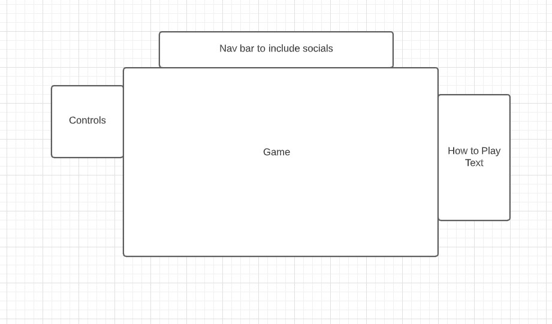

# Corgi-Run

## Checkout the Live Game Here! [Corgi Run](https://gogetaspirit.github.io/Corgi-Run/)

## Background
* Corgi Run is a web game inspired by temple run. Users will play as a "dog" and will have to navigate through obstacles by jumping.
Similar to temple run, the User will also be able to collect treats which will be added to their score. Once a user hits an obstacle the 
game will then be over.

## Functionality & MVP

* Start functionality
* User will be able to to slide using "left shift" and jump using "w" or "spacebar". 
* Game will be able to keep a tally of the score and store the high score in local storage.
* Obstacles will be of random height and appear from the side closing in.

## Wireframes

* Game controls will be listed on top. Directions on how to play and 
objectives will also be listed on the top.
* There will be a start button for the game as well.
* A nav bar will be included with my corresponding Github and LinkedIn links.

## Architecture and Technologies 

* Javascript 
* Canvas

## Implementation Timeline

Day 1: Setup.

Day 2: Researching and implementing game sprites.

Day 3: Implementing core game functionalities such as jumping.

Day 4: Finishing up core game functionalities.

Day 5: Cleaning up project, styling.

## Bonus MVPS

* Boosting.
* Collecting treats.

